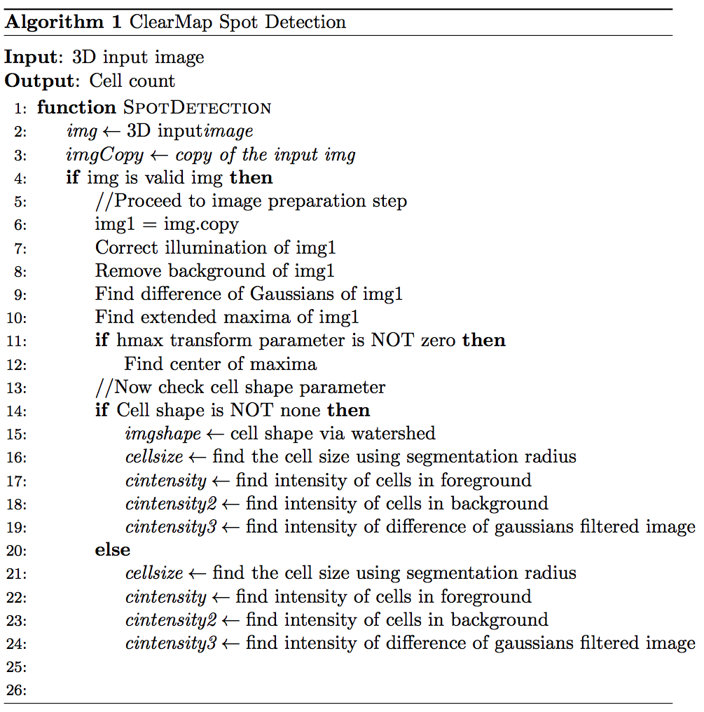

# setting

setting: given a stack of .tif files

loss: we evaluate performance via the 0-1 loss, $\delta: \mathcal{X} \times \mathcal{Y} \rightarrow {0,1}$, meaning, $\delta(x,y) := \mathbb{I}[g_n(x) \neq y]$ Specifically, an algorithm for cell detection is considered to be "superior" IF we can verify accuracy on existing brain data AND be able to compare the results with pre-annotated data from Ailey.

statistical task: learn a classifier that minimizes expected loss to calculate cell count

desiderata: we desire an approach that:

**works well in theory on certain settings**
- [ ] Must be useful for Ailey's brains
- [ ] Must work on resolution 5 images
    
**empirically performs well on simulations according to those settings AND is robust to those assumptions**
Simulations will include
- [ ] Fear brain (Since cells much more visible)
- [ ] High resolution brain data that is pre annotated and has a rough cell count
    
**empirically performs well on the real data is fast enough is easy to use approach**
- [ ] Must take less than 10GB of hard drive space to set up
- [ ] Must take less than 32GB of ram to utilize
    
# approach

paragraph explanation of approach: 
Simplistically - first a gaussian filter is used, followed by a peak detection step. This allows us to detect "spots" (image abnormalities) in the desired images.

More complex logic ->
Pretreatment
1. First the data must be treated. 3D tif stacks that I have must be taken from NDstore and using NDreg to read them, I have to slice them into .tif files.
2. Next I need to edit the Settings.py file directly inside ClearMap to adjust the settings for installation and Ilastik/Elastik preferences.
3. I need to edit the inner parameter files to match the direct parameters I wish to run. Since we are not using iDisco files, it's best to use the parameter files as a guidelines and to copy the contents to another markdown files.
4. The working directory of the tif files must be set in the python path.

Image Processing step
1. First a plot tiling tool is used to display the 3D volume as a collection of 2D images (like image-J or ITK-Snap)
2. Next the "background", or highest pixel intnesity value is removed through filtering to allow easier detection of "spots"
3. A difference of gaussians algorithm filter is the primary crux of the spot detection algorithm. It involves filtering a blurred version of the original image, and then finding the difference with a slightly less blurred image. This allows the user to use a band-pass filter that discards most spatial frequencies besides the key ones.
4. Extended Maxima and Center of Maxima are used to locate the spots based on the results from the difference of gaussians filter.

Cell Detection step
1. Based on the DOG filter results as the input, we detect the cell shapes
2. This shape input is used to calculate the size and intensity features
3. The results are plotted

# results

### why would it work well

For the Aut brains AND our purposes this would most likely not work well. In order for this algorithm to work efficiently, it requires a high level computational power and high resolution images. Additionally it also requires images which contain highly defined cell shapes. Our situation fails on all fronts.

Here are the listed requirements:
32Gb of RAM at least (128Gb recommended) -> 32Gb of RAM was listed as the absolute minimum required.
SSD drives recommended (1Tb at least)
Multicore Intel Xeon processor (6 cores recommended)

For the Fear brains it is plausible that we can obtain useful data, however an important note is that since we are working with resolution 5 images, even that is not guaranteed. The basis for the Fear brains is due to the much more clealry defined "spots" that are apparent in the images.

Examples that will most certainly work are volumes that are easily segmented using Ilastik. The basis for this is because the clearmap program suite actually fully incorporates Ilastik into its pipeline. Since the spot detection is an accompanying image processing tool, as long as the image is clearly segmentable the program should work fine.

Mathematically speaking, as long as the pixel density in the image is high enough such that the thresholded background removal step does not completely destroy all the information, enough information should remain such that we can calculate the cell detection features

#### simulations

Unfortunately because I do not how to x-11 forward to docker image hosted by cortex and because cortex does not have a 1 tb ssd harddrive, I was unable to produce any charts. Because of this I created a docker image of ClearMap set up instead, and wrote the code needed to run through the pipeline. The docker image of ClearMap has all the parameter and settings files modified and compiled for usage with Clarity brains.

Here is the jupyter notebook of the algorithms used .ipynb)
Here is the jupyter notebook of basic setup parameters I used .ipynb)

### how well does it work

Time specifications:
"Accuracy metric": We still need to derive some sort of accuracy metric to form our basis, however because we do not have the pre-annotated data we have no idea of even the approximate ballpark we are looking for.

